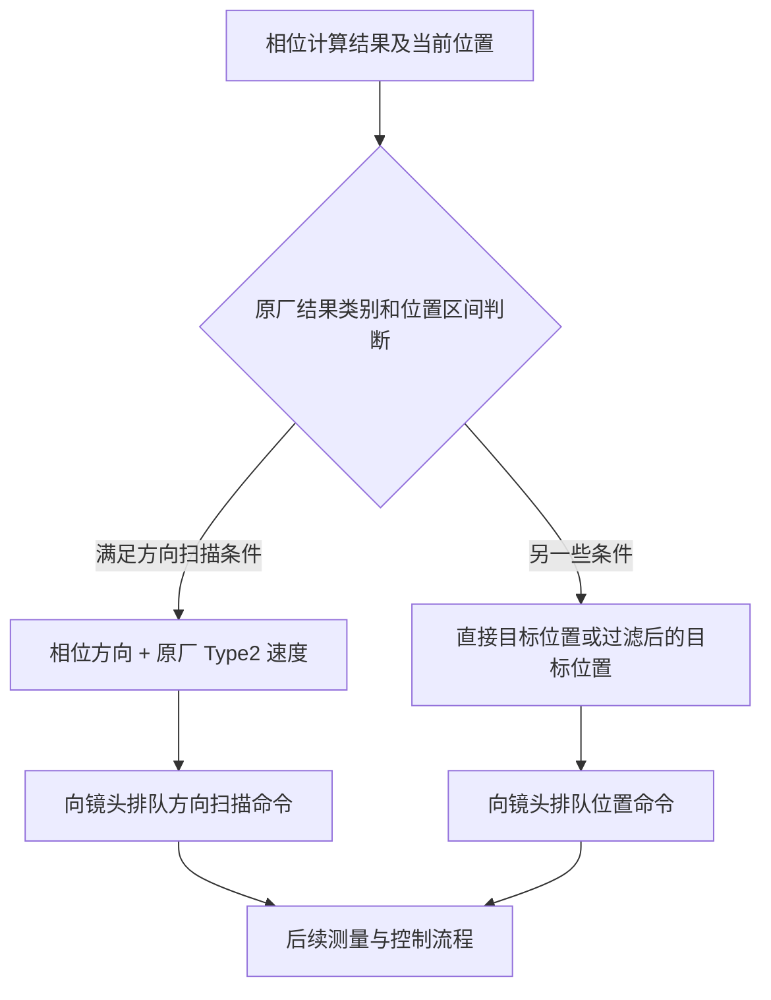

> 迁移的历史研究记录：原文描述的是当时的实验，不代表本次重新验证。外部依赖及本轮验证范围见仓库根目录 MIGRATION_DEPENDENCIES.md。

# X2D 相位对焦改为方向／速度控制：入口与缺口

## 本轮状态

用户报告已重启相机。此前三档临时补丁不是持久修改，不应视为重启后仍生效；最近一次 USB 查询未找到控制接口，未回读确认本次启动的代码。本轮只读官方固件，没有安装方向控制补丁，没有触发对焦，没有挂探针。

## 固定来源

第一代 X2D 100C 官方 4.2.0，系统库 `/lib64/libaaa.so`，SHA-256：
`feef8a8dc3a27395e47232c2b25a5da7a7ab335922fbb527e637c439e35bcec7`。
以下是静态控制流证据，不是当前镜头的实机执行轨迹。

## 已核对的控制流

`_exec_pdaf_afs_process` 位于 `0x90128`，长度 1872 字节。它不是只下发目标位置：有两处现成的方向扫描分支，也有直接位置和过滤后的位置分支。

| 位置 | 已确认行为 |
|---|---|
| `0x90638..0x906a4` | 检查当前位置是否在指定区间；成立时计算速度并排队扫描，不成立转位置路径。 |
| `0x906bc..0x906e0` | 同类区间判断，另检查状态字段；符合时跳第二个扫描分支，否则过滤后排队位置命令。 |
| `0x9080c..0x90868` | 第二个方向扫描分支。 |
| `0x9065c`、`0x90824` | 拍照扫描明确选择 Type2；内部 recording 分类用 Type5。 |
| `0x90688..0x906a0`、`0x90850..0x90868` | 相位方向转换为 `0x7fff`／`0x8000`，与计算速度一起交给 `lens_cmd_push_focus_scan_cmd`。 |
| `0x905d8` | 直接排队目标位置命令。 |
| `0x906e0`、`0x906fc` | 经 `_push_filtered_abs_cmd` 处理的位置命令。 |

`is_cur_pos_between_start_and_peak` 位于 `0x92ba8`，392 字节：依据当前位置到两个边界的距离选择比较方向，要求当前位置严格位于相应参考位置与峰值之间。不能把该判断强制为真后宣称保留了原厂的边界行为。

`get_speed_type_from_peak_distance` 位于 `0x36048`：输入的距离类别 1／2 分别映射拍照 Type1／Type2，默认映射 Type0；内部 recording 分类对应 4／5／3。它是已有距离**类别**到速度类型的映射，并不证明可把任意位置差直接当作该类别传入。

## 用户希望的新行为与尚缺内容

目标是保留相位测量，在机身内部根据到焦点的距离选择 Type0／Type1／Type2，对镜头只下发方向和速度，而不是目标位置。这会把到位控制的责任从镜头移到机身，不能仅靠替换命令或恢复之前的三档倍率实现。

尚未完成：

1. 接通相位距离／置信度到三档速度的分类条件；不能假设远近阈值。
2. 连续移动中更新方向和速度，避免越过目标后反复来回修正。
3. 在接近／到达焦点、相位失效、松开快门、取消对焦和到达行程边界时可靠停止。
4. 确认整条调用链的时序与终止条件，再制作和验证临时补丁。

已定位 `lens_cmd_push_focus_stop_cmd`、`lens_ctrl_stop_focus_motor` 和 `af_wrap_lens_stop_focus_motor`。本轮检查的相位处理函数没有直接调用这些停止入口；这**不代表整个原厂算法不会停止**，仅表示不能凭该函数的两处扫描调用证明替换后的停止链完整。

因此目前有可复用的方向扫描入口，但没有已验证、可安装的全程方向控制版本。保留原厂位置收尾是一种范围更小的候选，然而它不等于用户要求的“完全不发送目标位置”。
