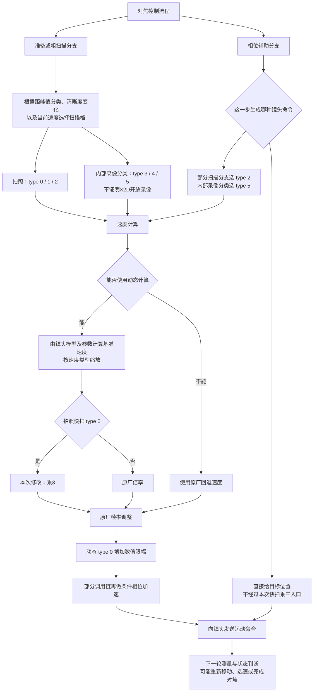

> 迁移的历史研究记录：原文描述的是当时的实验，不代表本次重新验证。外部依赖及本轮验证范围见仓库根目录 MIGRATION_DEPENDENCIES.md。

# X2D 4.2.0：六类速度与控制流程

依据：第一代 X2D 官方 4.2.0 `libaaa.so`，SHA-256 `feef8a8dc3a27395e47232c2b25a5da7a7ab335922fbb527e637c439e35bcec7`。这是静态调用和已验证速度计算分支图，不是本次半按对焦的实机执行轨迹。

## 当前实验

55V 动态拍照快扫 type 0 的 ×3 候选已实机写入并回读验证，不挂 strace，没有定时恢复。原厂文件不变；服务重启/相机关机重启后丢失。首次安装核对 `62` 个线程无追踪、无暂停。

动态 type 0 在帧率调整后限制到 0..21844。安装时回读三处相位加速配置，均不超过1.5；这使所核对链路的条件加速结果不超过32766。不是镜头机械极限认证，不保证所有对焦动作×3。换镜头前恢复或重启。正常动态计算的详细调试日志块被重排用于限幅，失败日志仍保留。

## 不是六个依次运行的状态机

六个数字是速度请求类型。控制流程可以反复选择、跳过、重新选速；并非每次对焦依次经过0→1→2→3→4→5。

## 六类的可确认差别

下面相对值仅描述动态计算成功、当前慢速系数为0.5时的原厂分档，尚未计帧率和条件加速。B为这一轮动态计算出的基准值，不是常量。

| 内部类型 | 本文描述 | 原厂动态分档 | 已确认的使用线索 | 本次改动 |
|---|---|---|---|---|
| 0 | 拍照快档 | B | 粗扫准备；距峰值分类默认档；粗扫选速 | ×3，再限幅 |
| 1 | 拍照慢档 | B/2 | 距峰值分类1；粗扫可重新选择 | 不改 |
| 2 | 拍照更慢档 | B/4 | 距峰值分类2；相位AF-S部分扫描分支 | 不改 |
| 3 | 内部录像分类快档 | B | 与type 0对应的内部分类 | 不改 |
| 4 | 内部录像分类慢档 | B/2 | 与type 1对应的内部分类 | 不改 |
| 5 | 内部录像分类更慢档 | B/4 | 与type 2对应的内部分类 | 不改 |

距峰值分类0/1/2如何由每帧相位与清晰度数据计算、何时切档的全部阈值，本轮没有完整重建；不能据此宣称固定的“远处一定快、近处一定慢”。实际相位AF-S也有直接位置命令，不能把位置数值当扫描速度。

## 代码证据定位

- `lens_ctrl_get_focus_speed`：`0xac380`，六类速度计算；`0xac518`动态入口；`0xac7b0`帧率修正。
- `get_speed_type_from_peak_distance`：`0x36048`，距峰值分类1/2映射拍照1/2或内部录像4/5，默认映射0/3。
- `cdaf_get_scan_speed_type`：`0x574e0`，结合距峰值、清晰度指标、当前档位及帧计数选择档位，包含提档等待逻辑。
- `push_lens_coarse_start_cmd`：`0x65ac4`附近请求0/3；粗扫初始化和主循环还有重新选速调用。
- `_exec_pdaf_afs_process`：`0x90644..0x906a0`与`0x9080c..0x90868`选择2/5并排队扫描；`0x905d8`和`0x906e0`附近有位置命令路径。
- `cdaf_get_scan_speed_time`：`0x56b34`调用速度计算，`0x56c48`再调用条件相位加速。

## 探针限制

已确认现象：全线程strace挂接期间用户无法对焦、画面卡住，停止后恢复。此前“挂接退出通过”不是不干扰相机的证明。当前探针禁止使用，实发最大速度未知。关于调度/系统调用追踪开销是可能原因，还未证明唯一根因。
