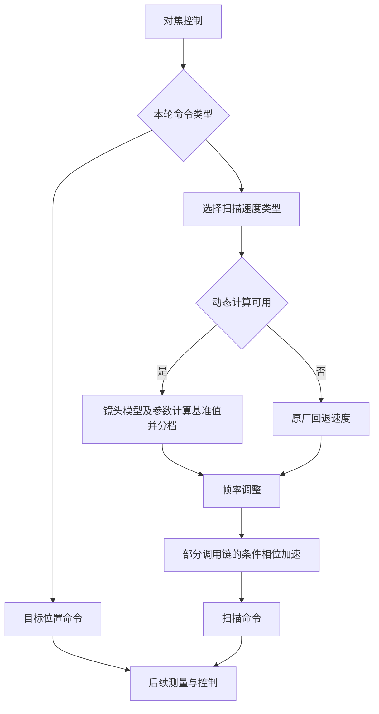

# 六类对焦速度与临时倍率实验

来源：官方 X2D 4.2.0 `libaaa.so`，哈希见本目录索引；本地六类速度流程记录和历史临时实验。本文不是当前相机的执行轨迹。

## 原厂计算与分档

六类是速度请求类型，不是六个必定依次经过的状态机。动态计算成功时，机身根据镜头模型及参数计算基准速度，再按类型缩放、调整帧率；部分调用链还会进行条件相位加速。动态计算失败时有原厂回退速度。

下表只适用于慢速系数为 0.5 的已分析分支；B 是当轮计算值，不是固定常量。尚未计入帧率调整和条件加速。

| 类型 | 内部分类 | 原厂动态分档 |
|---|---|---|
| 0 | 拍照快档 | B |
| 1 | 拍照慢档 | B/2 |
| 2 | 拍照更慢档 | B/4 |
| 3 | 内部 recording 快档 | B |
| 4 | 内部 recording 慢档 | B/2 |
| 5 | 内部 recording 更慢档 | B/4 |

内部 recording 分类的存在不能证明 X2D 对用户开放录像。相位 AF-S 也会直接发送目标位置，这些位置命令不经过上述扫描倍率入口。

## 静态定位

| 符号 | 地址 | 用途 |
|---|---:|---|
| `lens_ctrl_get_focus_speed` | `0xac380` | 六类速度计算 |
| 动态计算入口 | `0xac518` | 基准值计算分支 |
| 帧率修正位置 | `0xac7b0` | 速度调整 |
| `get_speed_type_from_peak_distance` | `0x36048` | 距峰值类别到速度类型的映射 |
| `cdaf_get_scan_speed_type` | `0x574e0` | 结合距离类别、清晰度和当前档位选速 |
| `cdaf_get_scan_speed_time` | `0x569d8` | 函数入口；内部 `0x56b34` 调用速度计算 |

## 历史临时实验及限制

55V 上曾对模式 2 的拍照 Type0/1/2 动态速度分别应用 ×3/×3/×2，并完成机内代码回读。内部 recording 分类未改。帧率调整后的三档数值限制为 0..21844，含回退值；当时回读三处条件加速配置均不超过 1.5，所核对链路的数值结果因此不超过 32766。

这是数值范围控制，不是镜头机械极限认证。补丁未修改原厂文件，相关服务重启或关机后失效；不能把历史记录称作现在仍有效。也没有证据证明整个对焦过程或马达实际速度按相同比例提高。

全线程系统调用追踪曾造成画面卡住和无法对焦，停止后恢复。该探针未得到可用的实际下发最大速度记录；追踪开销是否为唯一原因没有证明。后续不可把这种采集方式当作无干扰测量。
